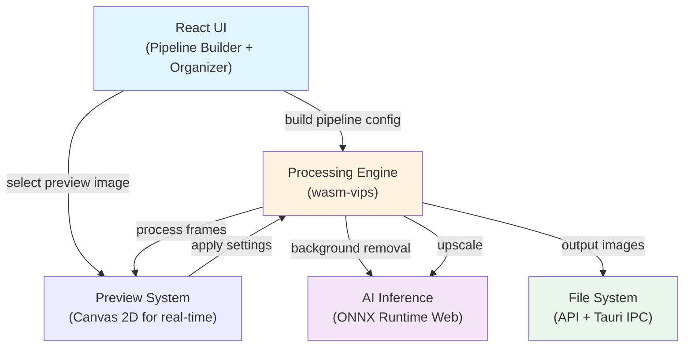

# Architecture

## High-Level Overview

Pixen is a fully client-side image processing and organization tool. Users build composable processing pipelines (resize → pad → compress → convert) and route outputs through organization rules (by date, by pattern, by size limit). All processing happens in the browser or via Tauri desktop; no server communication except for initial asset loading.

The system separates **processing** (wasm-vips) from **organization** (file system operations) into distinct stages. Users can disable organization and just process, or process + organize as a single workflow.

## Component Diagram



## Key Components

### 1. Pipeline System (UI Layer)
- **Pipeline Builder:** Drag-to-compose operations (Resize, Pad, Convert, Compress, Strip Metadata, Rename)
- **Recipe Manager:** Save/load/export named pipeline configurations
- **Built-in Presets:** Instagram, Shopify, Twitter, LinkedIn, Web, Archive
- State: JSON-serializable pipeline config, no side effects until commit

### 2. Processing Engine (wasm-vips)
- Direct WASM binding to libvips library
- Streams pixel data—never loads full images into memory
- **Operations:** resize (6 modes), pad (3 fill modes), convert (JPG/PNG/WebP/AVIF), compress (quality slider + perceptual mode), strip metadata, rename
- Handles color profiles (sRGB ICC preservation)
- Performance: 2–4x slower than native libvips, ~6x faster than pure JS

### 3. Preview System
- Canvas 2D for real-time preview on single selected image
- Drag-to-compare (before/after divider, Squoosh-style)
- Shows delta: original size → output size, dimensions, format
- Updates in real-time as user changes settings
- Batch preview: apply to 3–5 random samples before full commit

### 4. AI Inference Engine (ONNX Runtime Web)
- Lazy-loaded models (cached in IndexedDB after first download)
- Models: Background removal (post-MVP), Upscaling 2x/4x (post-MVP)
- Sequential queue only—never parallel (VRAM safety)
- Automatic fallback: WebGPU → WASM SIMD → WASM single-thread

### 5. Organization System
- **By Date:** EXIF `DateTimeOriginal` → file `lastModified`, granular (Year / Month / Day)
- **By Pattern:** Prefix match, regex capture groups, fuzzy matching
- **By Size Limit:** Batch files into N-GB chunks (cloud upload feature)
- **Custom Rules:** Combine modes (e.g., "group by month, then split each month into 2GB")

### 6. File System Abstraction
- **Web (Chromium):** File System Access API for folder picker + direct write
- **Web (Safari/Firefox):** ZIP download fallback
- **Desktop (Tauri):** Native file system access via Rust IPC backend

## Data Flow

```
USER INPUT
    ↓
[Drag-drop files OR file picker]
    ↓
[Queue: Array<File>]
    ↓
[Select preview target image]
    ↓
[Build pipeline config: Array<Operation>]
    ↓
[Show real-time preview on selected image]
    ↓
[Batch preview on 3–5 random samples]
    ↓
[User commits: Apply pipeline to all files]
    ↓
[Processing Engine: wasm-vips]
    → [Process each image in queue]
    → [Call AI for background removal / upscaling if needed]
    ↓
[Organization Engine]
    → [Group by date/pattern/size/custom rule]
    → [Create output folder structure]
    ↓
[File System Output]
    → [Web: Direct write (Chromium) OR ZIP download (Safari/Firefox)]
    → [Desktop: Write to user-selected directory]
    ↓
COMPLETE
```

## Key Design Decisions

| Decision | Rationale | ADR |
|----------|-----------|-----|
| **React + Vite** | Portfolio recognition, fast HMR, excellent WASM handling | [ADR-001](../docs/decisions/ADR-001-frontend-framework.md) |
| **wasm-vips over Canvas/ImageMagick** | Streaming API, color profile preservation, 6x faster than JS | [ADR-002](../docs/decisions/ADR-002-processing-engine.md) |
| **ONNX Runtime Web** | Production-ready, WebGPU backend, graceful WASM fallback | [ADR-003](../docs/decisions/ADR-003-ai-inference.md) |
| **Tauri over Electron** | 2.5–10MB vs 80–150MB, 30–40MB idle RAM vs 150–300MB | [ADR-004](../docs/decisions/ADR-004-desktop-framework.md) |
| **Cloudflare Pages** | Native COOP/COEP support for wasm-vips threading | [ADR-005](../docs/decisions/ADR-005-hosting.md) |
| **GitHub Releases for distribution** | Free CDN, no bandwidth limits, familiar for technical users | [ADR-006](../docs/decisions/ADR-006-distribution.md) |
| **Two-stage workflow: Process → Organize** | Separates concerns, allows processing without grouping | Design choice, see roadmap Section 4 |

## External Dependencies

- **wasm-vips:** JavaScript binding to libvips, loaded from CDN or bundled
- **ONNX Runtime Web:** Model inference, models cached in IndexedDB
- **File System Access API:** Chromium-only, fallback to ZIP + download
- **Tauri:** Desktop framework, Rust backend for native file I/O
- **React:** UI framework
- **Canvas 2D API:** Real-time preview rendering

## Constraints & Edge Cases

### Large Batches
- **Web:** Warn at 200–500 images; hard cap not enforced
- **Desktop:** Supports 1000+ images
- **Memory strategy:** wasm-vips streams pixel data; never loads full image into memory simultaneously
- **Queue preview:** Show only 3–5 samples to avoid preview lag

### GPU Limits
- ONNX Runtime: Sequential queue only (never parallel AI tasks)
- WebGPU/WASM auto-detection; graceful fallback
- Inform user of performance expectations (100–500ms WebGPU vs 3–8 sec WASM)

### File System Access
- **Cross-origin isolation required for wasm-vips threading**
  - Fallback to single-threaded build if unavailable
  - Inform user of degraded performance
- **File System Access API unavailable in Safari/Firefox**
  - Fallback to ZIP download
  - File names preserved in ZIP

### Performance Baselines (from roadmap)
- Background removal: 100–500ms (WebGPU), 3–8s (WASM)
- Upscaling: 2–15s per image depending on model
- Resize/pad/compress: <100ms per image with wasm-vips

## Testing Strategy

- **Unit tests:** 80% coverage minimum on utilities and pure functions
- **Integration tests:** Pipeline composition, operation chaining
- **E2E tests:** File upload → preview → process → organize → download (web) / write (desktop)
- **Performance tests:** Baseline metrics for wasm-vips operations
- **Accessibility:** WCAG 2.1 AA for UI
