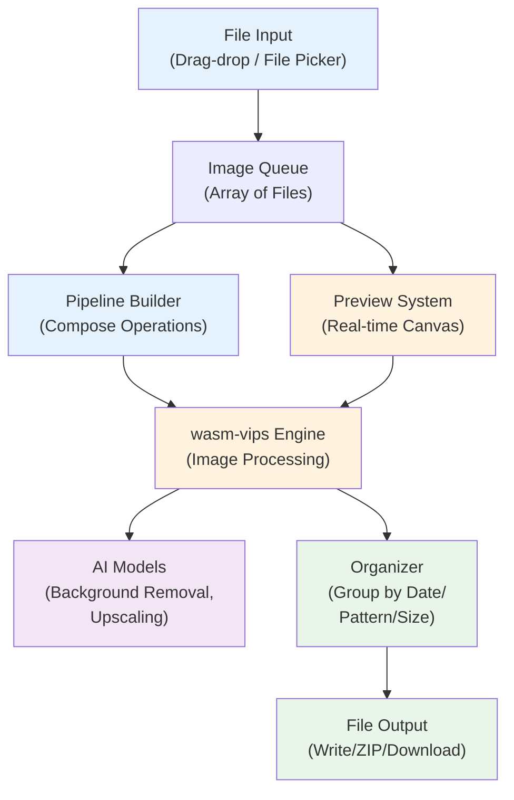

# Architecture

**Pixen is a fully client-side image processing and organization tool.** All computation happens in the browser (web) or via Tauri desktop application. No server involved. No data uploads.

For detailed architecture context used by AI agents, see [`.agent/context/architecture.md`](../.agent/context/architecture.md).

## System Overview



## Core Workflow

1. **Import:** User drags files or uses file picker to load images
2. **Build Pipeline:** User composes operations (Resize → Pad → Compress → Convert → etc.)
3. **Preview:** Real-time preview on single selected image; see before/after and file size delta
4. **Batch Preview:** (Optional) Apply to 3–5 random samples to verify results
5. **Process:** Apply pipeline to all images in queue via wasm-vips
6. **AI:** (Optional) Run background removal or upscaling if included in pipeline
7. **Organize:** Route processed images into folders by date / pattern / size limit / custom rule
8. **Output:** Write to disk (Tauri) or download as ZIP (web)

## Key Components

### Pipeline System
- **Builder UI:** Drag-to-compose operations
- **Recipe Manager:** Named, saved, exportable pipelines
- **Built-in Presets:** Instagram, Shopify, Twitter, LinkedIn, Web, Archive
- **Operations:** Resize (6 modes), Pad (3 fill modes), Convert (JPG/PNG/WebP/AVIF), Compress (quality + perceptual modes), Strip Metadata, Rename

### Processing Engine (wasm-vips)
- Image processing library (libvips) compiled to WebAssembly
- Streams pixel data—never loads full image into memory
- Handles color profiles (sRGB ICC preservation)
- Performance: ~6x faster than pure JavaScript, ~2–4x slower than native libvips

### Preview System
- Canvas 2D API for real-time preview on selected image
- Drag-to-compare divider (before/after)
- Shows file size delta, dimension changes, format change
- Updates as user modifies pipeline settings

### AI Inference (Post-MVP)
- **Framework:** ONNX Runtime Web
- **Models:** Background removal, upscaling (2x, 4x)
- **Backend:** WebGPU (primary), WASM SIMD + Threads (fallback), WASM single-thread (legacy)
- **Performance:** 100–500ms (WebGPU), 3–8s (WASM) for background removal
- **Caching:** Models cached in IndexedDB after first download
- **Queue:** Sequential only (never parallel, for VRAM safety)

### Organization System
- **By Date:** EXIF metadata or file modified time (Year / Month / Day granularity)
- **By Pattern:** Prefix match, regex capture groups, fuzzy matching
- **By Size:** Batch files into user-defined chunks (1GB, 2GB, 4GB, custom)
- **Custom Rules:** Combine modes (e.g., "group by month, then split into 2GB batches")

### File System Abstraction
- **Web (Chromium):** File System Access API for folder picker and direct write
- **Web (Safari/Firefox):** ZIP download fallback
- **Desktop (Tauri):** Native file I/O via Rust backend

## Hosting & Deployment

### Web (PWA)
- **Host:** Cloudflare Pages (required for COOP/COEP headers)
- **Headers required:**
  ```
  Cross-Origin-Opener-Policy: same-origin
  Cross-Origin-Embedder-Policy: require-corp
  ```
  These enable `SharedArrayBuffer` for wasm-vips multi-threading.

### Desktop
- **Framework:** Tauri 2.x (wraps React frontend, adds native file system)
- **Builds:** Windows (.exe), macOS (.dmg), Linux (.AppImage/.deb)
- **Distribution:** GitHub Releases (via GitHub Actions CI/CD on tag push)
- **Size:** 2.5–10MB (vs Electron at 80–150MB)

## Data Models

See [`.agent/context/data-model.md`](../.agent/context/data-model.md) for detailed schemas.

**Core entities:**
- **Pipeline:** Array of operations with parameters (JSON-serializable)
- **Recipe:** Named pipeline with metadata (id, name, created, version)
- **Image Batch:** Array of File objects with metadata (name, size, dimensions)
- **Organization Config:** Grouping mode + rules (date pattern, regex, size limit, etc.)

## Design Decisions

All architectural decisions are documented as Architecture Decision Records (ADRs) in [`docs/decisions/`](../decisions/):

- **ADR-001:** Frontend Framework (React + Vite)
- **ADR-002:** Processing Engine (wasm-vips)
- **ADR-003:** AI Inference (ONNX Runtime Web)
- **ADR-004:** Desktop Framework (Tauri)
- **ADR-005:** Web Hosting (Cloudflare Pages)
- **ADR-006:** Desktop Distribution (GitHub Releases)

See each ADR for detailed rationale, alternatives considered, and consequences.

## Performance Targets

| Operation | Target | Notes |
|-----------|--------|-------|
| Resize/Pad/Compress | <100ms per image | wasm-vips streaming |
| Background Removal | 100–500ms (WebGPU), 3–8s (WASM) | Sequential queue |
| Upscaling | 2–15s per image | Depends on model; sequential |
| File I/O (organized) | <5s for 100 files | Tauri native or Web API |
| Large batch (1000+ images) | Desktop recommended | Web warns at 200–500+ |

## Testing Strategy

- **Unit tests:** 80% coverage minimum on utilities and pipeline operations
- **Integration tests:** Operation chaining, recipe composition
- **E2E tests:** Import → preview → process → organize → output
- **Performance tests:** Baseline metrics for wasm-vips and ONNX Runtime
- **Accessibility:** WCAG 2.1 AA for UI

## Constraints & Limitations

- **Browser batches:** Practical limit 200–500 images (warn, no hard cap)
- **GPU concurrency:** AI operations always sequential (VRAM safety)
- **File System Access API:** Chromium-only; Safari/Firefox use ZIP fallback
- **Cross-origin isolation:** Required for wasm-vips threading; fallback to single-threaded build
- **Image formats:** Input JPG, PNG, WebP, AVIF, GIF, TIFF, HEIC (via wasm-vips); Output JPG, PNG, WebP, AVIF
